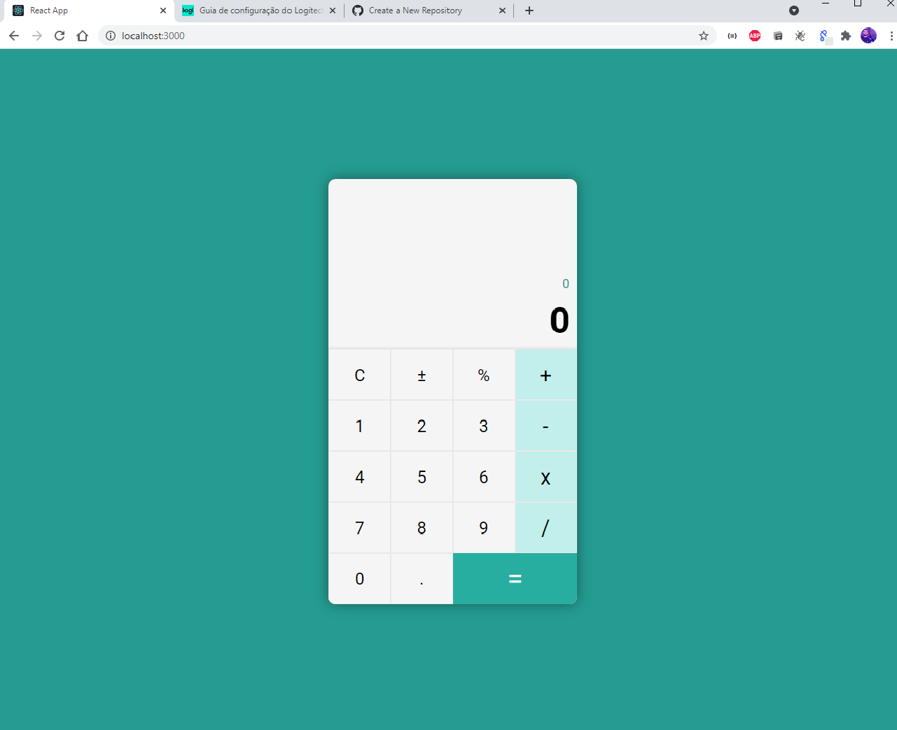

# calculator




> O projeto trata-se de uma calculadora. Nele, você será capaz de realizar operações matemáticas simples. Esse projeto está sendo desenvolvido com as tecnologia <strong>HTML5</strong>, <strong>CSS3</strong>, <strong>Javascript</strong> e <strong>ReactJS</strong>.

### Ajustes e melhorias

O projeto ainda está em desenvolvimento e as próximas atualizações serão voltadas nas seguintes tarefas:

- [X] Design
- [X] Resposividade
- [ ] Funcionalidades


## 🚀 Como executar o projeto


### Pré-requisitos

Antes de começar, você vai precisar ter instalado em sua máquina as seguintes ferramentas:
[Git](https://git-scm.com), [Node.js](https://nodejs.org/en/). 
Além disto é bom ter um editor para trabalhar com o código como [VSCode](https://code.visualstudio.com/)


#### 🧭 Rodando a aplicação web (Frontend)

```bash

# Clone este repositório
$ git clone https://github.com/devCleidison/calculator.git

# Acesse a pasta do projeto no seu terminal/cmd
$ cd README-ecoleta

# Vá para a pasta da aplicação Front End
$ cd calculator

# Instale as dependências
$ npm install ou yarn start

# Execute a aplicação em modo de desenvolvimento
$ npm run start ou yarn start

# A aplicação será aberta na porta:3000 - acesse http://localhost:3000

```

---

## 🛠 Tecnologias

As seguintes ferramentas foram usadas na construção do projeto:

#### **Website**  ( [React](https://reactjs.org/) )


[⬆ Voltar ao topo](#calculator)<br>